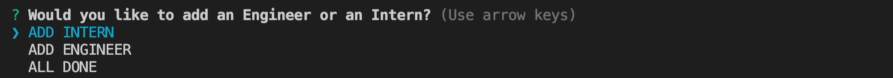
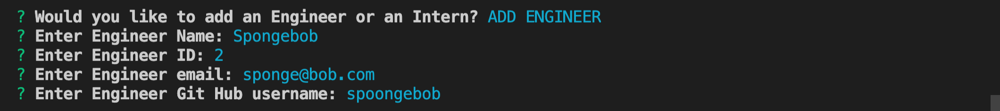
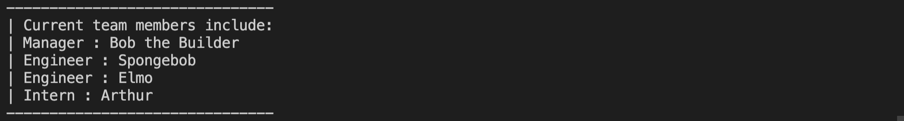
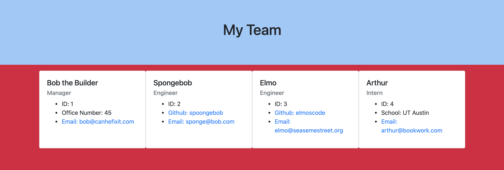

# Team Profile Generator

This week's assignment had us design a command line tool that could generate an HTML file based on input from the user. This HTML file will describe our work team. 

### 1. Install Requirments

Before running the program, make sure to run the following command to install dependencies,:

        npm i

### 2. Getting Started

To run the program enter the following command:

        node app.js

### 3. Setting a Manager

The first prompts will ask you to enter the information of your manager. There is only one manager per team therefore this will be asked first and never again. 

### 4. Adding Team Members

Once you've filled in the information of your manager, you man now enter in the information of other team members. You can either add an Engineer or an Intern. 

When either Engineer or Intern is chosen, you will be prompted to enter in their information.

As you continue to add team members, a small box will appear on the top of the terminal entry after a member is added. This box will display the current members of the team as well as their position. 

### 5. Finishing 

Once you are done building your team, you may select the "ALL DONE" option and the following will appear in your terminal. 

Congradulations! You have successfully created a team! You may now view your team and their details on the output.html file that has been automatically generated. 

